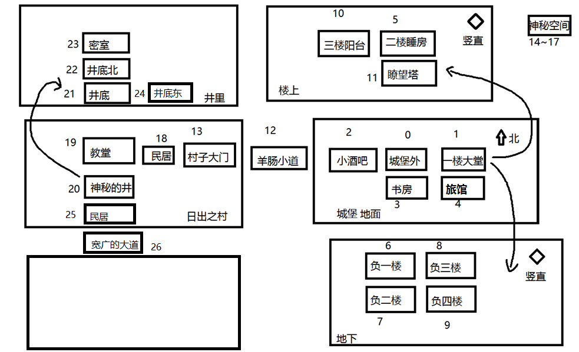

# This repository is deprecated, please see this [Castle-game](https://github.com/icela/Castle-game).

                                                                                                                                                                                                                                                                                                                                                                                                            
# 城堡游戏

### [Android版](https://github.com/ice1000/AIAndroid)

目前我正在使用Java继续更新这个项目，请移步[Java分支](https://github.com/ice1000/Castle-game/tree/java)

# 内容介绍

GUI版与CUI版共存。 
[v1.0纯Java版](https://github.com/ice1000/Castle-game/releases/tag/v1.0) 
[v1.2Java&Kotlin版](https://github.com/ice1000/Castle-game/releases/tag/v1.2) 
[v1.2.1含jar包Java&Kotlin版](https://github.com/ice1000/Castle-game/releases/tag/v1.2.1) 
Java初学者可通过此项目的v1.0对于OOP的设计模式有一个初步的了解。 
v1.1展示如何使用Kotlin和Java进行简单的对接。 
地图： 

# 运行方法
这个必须看哦！

1. 安装jre8
1. 找到[CUI的jar包](./out/_CUI_jar/城堡游戏.jar)或者[GUI的jar包](./out/_GUI_jar/城堡游戏.jar)
1. 使用以下命令运行：
> java -jar 城堡游戏.jar
1. enjoy

# 实现情况
- [X] 一个图标
- [X] 地图系统(完善)
- [X] 存档系统(完善)
- [X] 战斗系统(完善)
- [X] BOSS系统(不完善)
- [X] 等级系统(较为完善)
- [X] ~~GUI~~封装的CUI
- [X] GUI、CUI双版本共存
- [X] 地图存储在SQLite中。
- [ ] 物品、背包系统
- [ ] NPC系统
- [ ] 与服务器端的通讯。

# 更新日志

## 本次更新

### 2016年5月 记不得多少号了
1. 增加jar包，可以直接运行

## 早期更新

### 2016年4月19日
删除过时的运行方法： 
> ## 你使用基于Linux或者Unix的操作系统
~~你了不起啊你这是歧视瘟都死吗~~ 
看到那个jar包了吗，castle.jar，这个是我已经打包好了的。 
所以你们只需要打开终端 
在终端先进入城堡游戏文件夹。 
如果你想尝试CUI版，请输入： 
>> $ java -jar ./castle-cui.jar

> 如果你想尝试GUI版，请输入： 
>> $ java -jar ./castle.jar

> ~~按理说应该是可以运行的。~~
## 你使用瘟都死操作系统
~~滚去学习如何编译运行~~ 
首先确保你安装了Java8的环境。 
如果没有的话，请百度“jre”。 
右上角"download zip"看到了吗，下载下来，解压， 
然后根据你的需求，找到“城堡游戏-GUI.exe” 
双击运行就行了。 
Windows平台不提供CUI的可执行文件，如果你执意运行的话，cmd运行jar包吧。 
方法和上面一样。

### 2016年4月2日
1. 挖坟——继续更项目
1. 增加地图元素
1. 将部分类转化为Kotlin代码
1. 从此踏上了Kotlin的不归路

### 2016年2月15日
1. 更多的移植到SQLite。

### 2016年2月11日、12日
1. 地图数据库移植到SQLite中。 
[SQLite脚本](./source/data.sql "这个是直接复制的脚本，用DataGrip搞的")

### 2016年2月2日
1. 更新了map指令图片显示不出来的bug

### 2016年2月1日
1. 根据[j8的朋友的反馈](http://tieba.baidu.com/p/4332888079?pid=83364878659#83364878659 "百度贴吧")修复了一个空指针异常 感谢这位朋友！
1. 更改背景颜色。
1. 增加3个新指令。
1. 扩张地图。日出村增加了井底。
1. 修复无法退出的bug。
1. 每次更新textArea时滚动到最下方。

### 2016年1月31日
1. 在奶茶同学的要求下，分别封装了CUI和GUI两个版本，各自有各自的main。（工作量极大！！)
1. 因此有了两个MANIFEST。
1. 然后更改了重命名的方式。
1. 大量简化API。

### 2016年1月30日
1. 扩张地图。增加了一个村庄。
1. 来到一个地方的问候方式改变。
1. 开始做物品系统。
1. 简化代码

### 2016年1月29日
1. 有了~~GUI~~GUI封装的CUI
1. 修复GUI无法退出的问题
1. 修复GUI无法重命名、重命名之后又反正就是乱七八糟的一大堆解释起来很麻烦的问题

### 2016年1月29日
1. 封装了所有数据库操作
1. 将所有的交互放在了主类中
1. 现在可以保存每个Room的状态了
1. 妈的今天修bug修惨了，我真可怜

### 2016年1月28日
1. 大规模更改设计模式, 用一个地图类封装了地图的操作
1. 扩张地图

### 2016年1月27日
1. 扩张地图
1. 增加新企划

### 2016年1月26日
1. 解决存档的问题
1. 修复地点不能保存的bug

### 2016年1月26日 
1. 各种封装
1. 写Javadoc
1. 搞了个图标出来
1. 去掉暂时无用的功能

### 2016年1月25日
1. 游戏完整化
